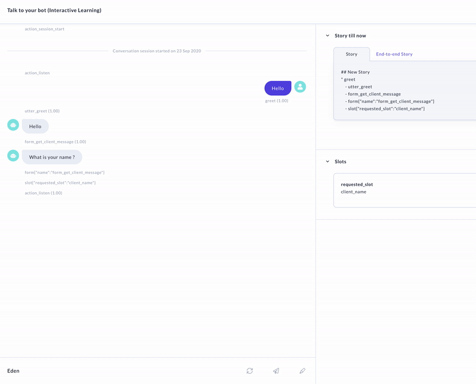

# for example purposes only

discussion at [Rasa community forum](https://forum.rasa.com/t/how-to-create-a-chatbot-which-asks-name-email-and-message/33732/11?u=jusce17)

## 👷‍ Local Installation

```
conda create -n envName python=3.6
conda activate envName
pip install python-dateutil==2.8.0
pip install sanic==19.9.0
pip install rasa
pip install rasa-x --extra-index-url https://pypi.rasa.com/simple

```
This will install Rasa and all of its requirements.
Note that this bot should have conda and pytnon 3.6 installed in your machine

pull this repo , train and run your assistant

```
rasa train
rasa x

```
On another Terminal start your Action Server


```
rasa run actions -vv

```


